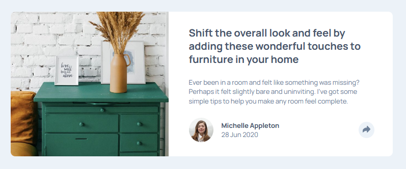
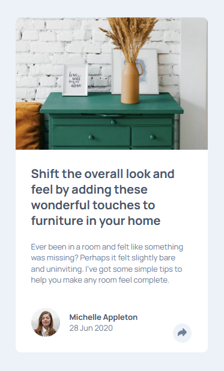

# Frontend Mentor - Article preview component solution

This is a solution to the [Article preview component challenge on Frontend Mentor](https://www.frontendmentor.io/challenges/article-preview-component-dYBN_pYFT).

## Table of contents

- [Overview](#overview)
  - [The challenge](#the-challenge)
  - [Screenshot](#screenshot)
  - [Links](#links)
- [My process](#my-process)
  - [Built with](#built-with)
  - [What I learned](#what-i-learned)
- [Author](#author)

## Overview

### The challenge

Users should be able to:

- View the optimal layout for the component depending on their device's screen size
- See the social media share links when they click the share icon

### Screenshot

Desktop:

Tablet:

Mobile:

### Links

- Solution URL: [https://github.com/bsd-rgb/Article-Preview-Component](https://github.com/bsd-rgb/Article-Preview-Component)
- Live Site URL: [https://bsd-rgb.github.io/Article-Preview-Component/](https://bsd-rgb.github.io/Article-Preview-Component/)

## My process

### Built with

- HTML
- CSS
  - Flexbox
  - CSS Grid
- JavaScript

### What I learned

Firefox and Chrome calculate the browser positioning differently. So its best to have an element absolutely positioned to something other than the page itself.

## Author

- Frontend Mentor - [@bsd-rgb](https://www.frontendmentor.io/profile/bsd-rgb)
